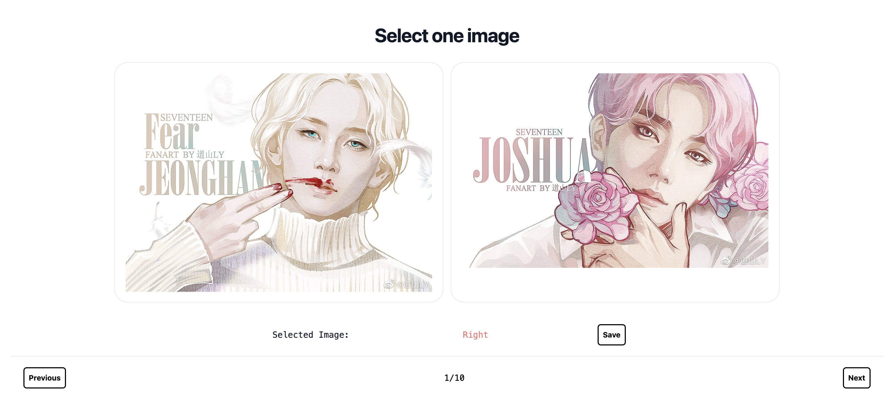
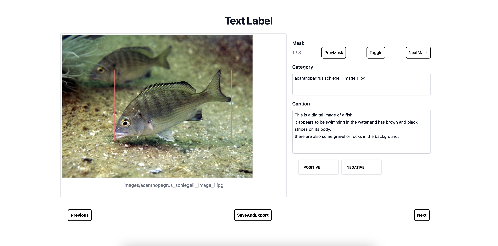

# LabelTool

> some useful label tool for image label and annotation label

## Image Label
> html+tailwindcss+javascript

 choose one image by specific standard from two given images

 

## Text Label 
> html+tailwindcss+javascript
* prepare data: images, masks on images, category and annotation of each mask
* modify one category and annotation of each image
* label the correctness of the category and annotation
* [demo](https://joyceyj.github.io/LabelTool/)- upload the json data (sample:demo_data/annotations_captions.json)
